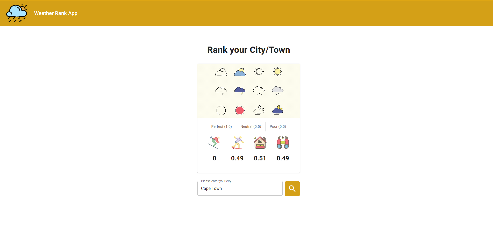

# Getting Started with Weather-Rank App



## Available Scripts

In the project directory you will find two folder:

### weather-rank-api

#### Project Structure:

```
weather-rank-api
├── src
│ ├── api - Integration to Open Meteo
│ ├── config - Overall config file env variables, port etc..
│ ├── resolvers - resolvers
│ ├── schemas - schemas
│ ├── server.ts - Apollo server bootstrap


/src
  /api                # API integrations
    WeatherApi.ts     # Concrete API client
    IWeatherApi.ts    # Interface
  /services           # Business logic
    DailyWeather.ts   # Consumes WeatherApi
  /interfaces         # Shared interfaces
    ICoordinates.ts

```

#### Start project:

In the project directory, you can run:

### `npm install`

### `npm run dev`

Runs the Apollo Server in the development mode.\
Open [http://localhost:4001](http://localhost:4001) to view it in the browser.

### weather-rank-fe

#### Start project:

In the project directory, you can run:

### `npm install`

### `npm start`

Runs the app in the development mode.\
Open [http://localhost:3000](http://localhost:3000) to view it in the browser.

The page will reload if you make edits.\
You will also see any lint errors in the console.

## Understanding Rank Calculations

The system calculates activity desirability scores (0-1 scale, where 1 = ideal conditions) based on 7-day weather averages:

### Scoring Formulas

| Activity       | Formula                                           | Threshold Values       |
| -------------- | ------------------------------------------------- | ---------------------- |
| **❄️ Skiing**  | `Math.min(avgSnowfall / 50, 1)`                   | 50mm = 1.0, 25mm = 0.5 |
| **🏄 Surfing** | `1 - Math.min(avgPrecipitation / 10, 1)`          | 0mm = 1.0, ≥10mm = 0.0 |
| **🌳 Outdoor** | `1 - (avgPrecipitation/20 + avgCloudCover/100)/2` | 0mm/0% = 1.0           |
| **🏛️ Indoor**  | `(avgPrecipitation/20 + avgCloudCover/100)/2`     | 100% clouds/rain = 1.0 |

## Activity Ranking Algorithm

### Scoring Overview

Scores range from **0-1**, where:

- `1` = Perfect conditions for the activity
- `0` = Worst possible conditions
- Values between represent suitability levels

---

### Calculation Methodology

#### 1. Weekly Averages

All scores use **7-day average** values:

```typescript
avgSnowfall = total snowfall_sum / 7
avgPrecipitation = total precipitation_sum / 7
avgCloudCover = total cloud_cover_mean / 7
```

### Threshold Reference Guide

| Activity       | Perfect Score (1.0)     | Neutral (0.5)           | Poor (0.0)              |
| -------------- | ----------------------- | ----------------------- | ----------------------- |
| **❄️ Skiing**  | ≥50mm snowfall          | 25mm snowfall           | 0mm snowfall            |
| **🏄 Surfing** | 0mm rain                | 5mm rain                | ≥10mm rain              |
| **🌳 Outdoor** | 0mm rain + 0% clouds    | 10mm rain OR 50% clouds | 20mm rain + 100% clouds |
| **🏛️ Indoor**  | 20mm rain + 100% clouds | 10mm rain OR 50% clouds | 0mm rain + 0% clouds    |

### Architecture Overview & Technical Choices

The project follows a monorepo architecture, where both the frontend (FE) and backend (API) codebases coexist in a single repository (weather-rank).

**Client-Server Architecture**: FE (React/TypeScript) and API (Node/GraphQL) separation for scalability.

**GraphQL API**: Efficient data fetching with typed queries (Apollo Server) and schema-first design.

**Dependency Injection**: Services (e.g., WeatherService) injected via context.

**Modular Design**: Clear separation (schemas, resolvers, services) adhering to SOLID principles.

**Type Safety**: TypeScript end-to-end (interfaces, generics) reducing runtime errors.

**Axios Clients**: Dedicated API instances (weatherApi, geocodingApi) for external services.

**Error Handling**: Structured errors in resolvers/services with meaningful user feedback.

**React Hooks**: useLazyQuery for on-demand GraphQL data fetching in FE.

**Material-UI**: Consistent UI components with responsive layouts.

**Routing**: React Router with Apollo Provider integration for SPA navigation.

**State Management**: Local state (useState) for simple UI state, avoiding over-engineering.

**Environment Config**: API URLs configurable via env vars for deployment flexibility.

**Documentation**: JSDoc Standard and GraphQL descriptions for maintainability.

**Performance**: GraphQL minimizes over-fetching; FE lazy-loads queries.

**Validation**: Input validation in FE and API (e.g., city name checks).

**Testing Readiness**: Interfaces (IWeatherService) enable easy mocking.

**Code Reusability**: Shared interfaces (e.g., IActivityRanking) across FE/BE.

**UI/UX**: Loading/error states and interactive feedback (e.g., search button).

**Build Tools**: Implicit use of bundlers (likely Webpack/Vite) via React/TypeScript.

**Scalability**: Feature-based structure (e.g., api/, interfaces/) supports growth.

### How AI assisted me in the process.

DeepSeek assisted in researching and understanding the threshold for snowfall, rain, cloud and etc...

### Omissions &amp; Trade-offs

- I wanted to use some Middleware, Morgan for logging, Helmet for HTTPS security, however that would require me to implement ApolloServer + Express Server, it would be a bit out of scope.
- I have not implemented any TDD
- My validations could be more robust, eg: In the FE I wanted to use yup for validation, but I opt to implement a custom validation myself. In the BE I could also use class-transform and class-validator, I also opt to implement myself, it's there but not as robust as it should be in PROD.

- GraphQL over REST: Optimized for flexible queries but adds complexity.

- No global state: Context/Redux omitted as unnecessary for current scope. (There no need for it)

- Interfaces over classes: Lightweight contracts where inheritance isn't needed.

In the service layer (WeatherService) getWeatherData method I am return any, this was done in purpose as Iam focuses on raw data fetching

- GraphQL resolvers handle data transformation and shaping with the appropriate type.

- This keeps the service layer simple and focused

Flexibility:

- Different GraphQL queries might need different data shapes

- Returning raw data lets resolvers transform it as needed

Performance:

- Avoids unnecessary data processing if some fields aren't needed

- Letting GraphQL optimize what gets sent to clients

### NOTE

The snowfall_sum array is returns 0 elements [0,0,0,0,0] for any locations, I believe there might something wrong with the Open Meteo API.
